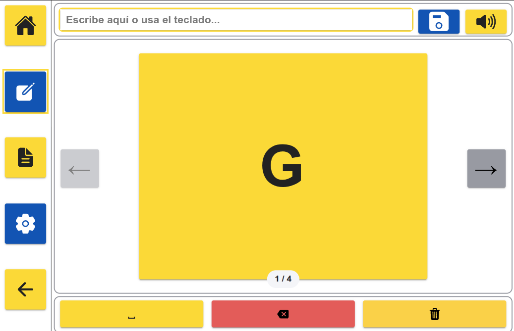
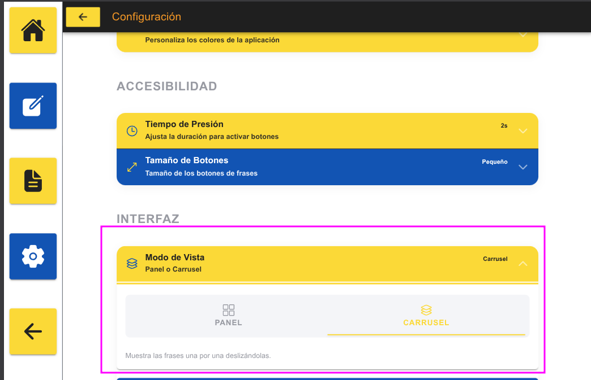
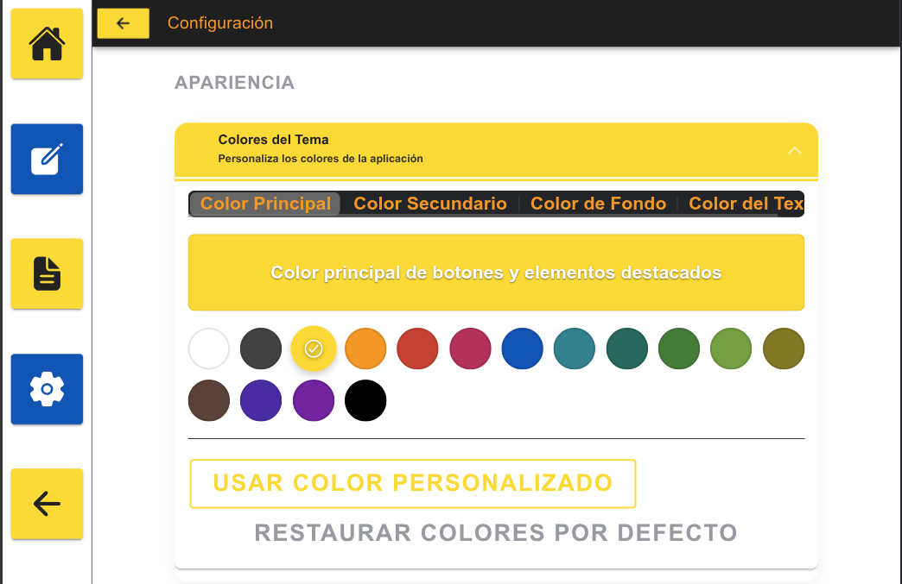
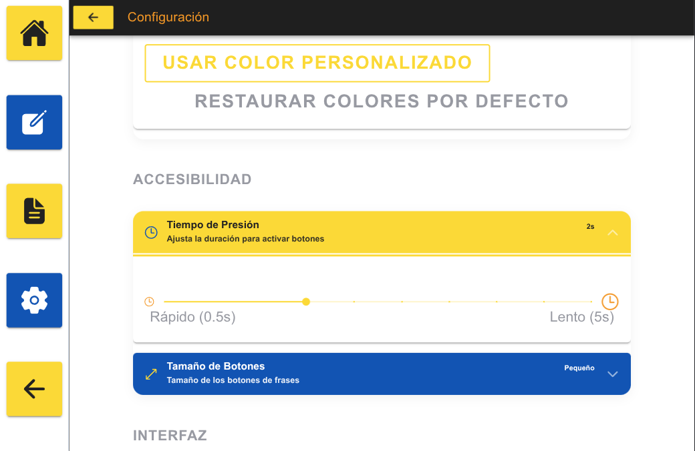

# TEXTO A VOZ APP - MANUAL

# PROPÓSITO DE LA APLICACIÓN (Problemas enfrentados y soluciones):

- Esta aplicación se ha creado pensando en un persona que por problemas de salud presenta las siguientes limitaciones

  1- No puede hablar o esta muy limitado

  2- Limitaciones en movimiento y poco control de los movimientos, bien posibilidad de espasmos

  3- Problemas visuales, no control de movmiento del ojo, esto impide la uitlización de elementos de hadware que permiten el control de la tablet o el pc mediante la vista

- Soluciones aportadas:
  - Cada vez que se carga una página o se aprieta un botón una voz informa alusuario de lo que está pulsando y de donde se encuentra, de esta forma ayudacon los problemas visuales
  - Cada vez que se pulsa un botón se informa de que botón se esta pulsando y cuando se produce una acción se informa dela acción realizada. Siempre por voz para que elusuario este informado
  - Los colores son personalizables hay usuarios que ven mejor colores oscuros y losha que ve mejor colores claros
  - Intentamos que no haya dos botones pegados del mismo color, de esta forma al ver dos colores el usuario puede distinguir más fáciil la existencia de dos botones
  - Para evitar los click accidentales por spamos y para ayudar al usuario que no controla, el efecto click, no se produce sino que hay que estar un tiempo determinado pulsando un botón para que la acción se lance

## PÁGINA DE INICIO:

- En esta página aparecen cinco botones que so para navegar:
  - Ir a home
  - Ir a la sección de escritura
  - Ir a la sección de frases
  - Ir a la sección de configuración
  - Ir atrás

## ESCRITURA DE FRASES

- ZONA SUPERIOR:
  -El input en el que se escribirá la frase, un botón para guardar la frase en la sección de frases habituales, y un altavoz para que la tablet reproduzca lo q ue hay escrito en el input.

- VISTA POR DEFECTO:
  - En esta vista vemos 8 botones, con grupos de letras y numeros, cada uno de estos botones nos lleva hacia otra página donde se escribirá una letra o un número del grupo.
  - En la parte inferior 3 botoens ( espacio en blanco, borrado una letra borrado frase)
  - 

- VISTA SLIDER
  - 
  - 
  - En la vista slider aparecerá un sólo botón. En lugar de los 8, este botón pasados unos segundos o pulsando las flechas, pasa al siguiente, el botón es más grande, lo que permite a un usuario con problemas de visión ver mejor.
  - El tipo de vista es configurable en la sección de configuración así como el tiempo que transcurre para que el slider cambie el grupo de letras
  - 
  - 

## FRASES GUARDADAS

- En esta sección tendremos frases guardadas en botones, la idea es podeer tener frases como necesito ir al baño, o me duele, frases rápidas de uso diario o frecuente.
- En la página de configuración podemos configurar el número y el tamaño de los botones,
  - 
  - 

## PANTALLA CONFIGURACIÓN

- Esta sección esta pensada para que ua persona que acompañe al usuario: FAmiliar psicólogo... configure la aplicación de la forma que más convenga al usuario
- Permite configurar todas las opciones vistas anteriormente más el tiempo de pulsación y los colores de los botones.
- 
- 
